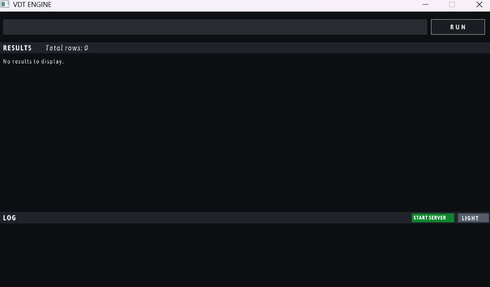
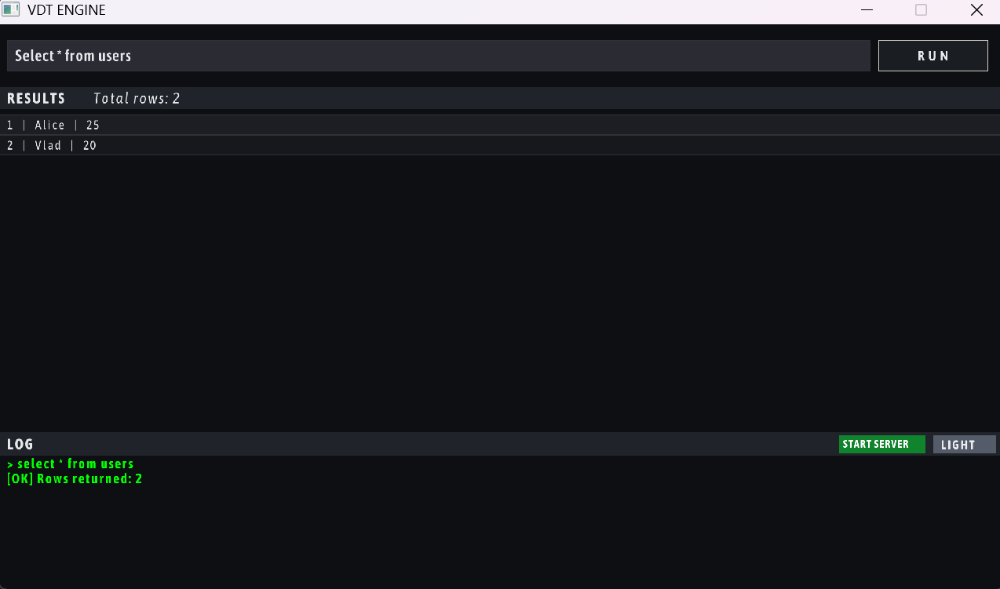
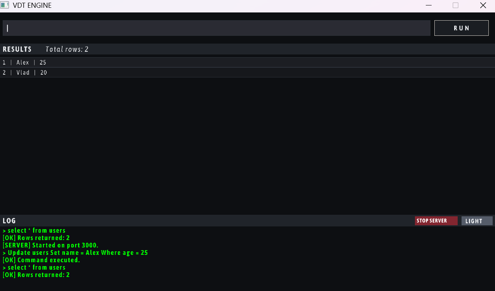

# VDT_Engine

A lightweight relational database engine written in **C++23**, built for use in MVPs and small projects where you need a simple, embedded database with an interactive GUI and remote access over TCP.

---

## What is this?

VDT_Engine is a self-contained SQL database engine you can drop into a project and run locally. It exposes a **TCP server** so any application — regardless of language — can send SQL queries and receive results over a plain text protocol. It also ships with a **Raylib-based GUI** for interactive query execution and visual result browsing.

It is intentionally minimal. No heavy dependencies, no configuration files, no installation. Compile and run.

---

## Why use it in an MVP?

- Zero infrastructure — runs as a single binary on any Windows machine
- Remote access via TCP — connect from C#, Python, Node, or anything that can open a socket
- Persistent storage with WAL-based crash recovery
- B+ tree indexing for fast lookups
- GUI for quick manual queries during development

---

## Interface

The GUI is intentionally simple and split into 3 sections: a **query input** area where you type SQL, a **result panel** that displays the returned rows, and a **logs** section that shows server activity and execution messages.


If the command succeeds, the result will appear in the **result panel** and a confirmation message will be written to the **logs** section.


Once you press the **Start Server** button, the **logs** section will display the port the TCP server has opened on — use that port to connect from your application.




---

## TCP Protocol

The engine starts a TCP server on a free port in the range **3000–8000** (printed to the GUI on startup).

**Request** — send a SQL query terminated with `\n`:
```
SELECT * FROM users WHERE age > 18\n
```

**Response** formats:
| Case | Response |
|------|----------|
| Success, no rows | `OK\n` |
| Success, with rows | `col1\|col2\|col3\n` per row |
| Error | `ERROR: <message>\n` |

---

## Connecting from C#

### Basic connection helper

```csharp
using System.Net.Sockets;
using System.Text;

public class VDTClient : IDisposable
{
    private readonly TcpClient _client;
    private readonly NetworkStream _stream;
    private readonly StreamReader _reader;
    private readonly StreamWriter _writer;

    public VDTClient(string host, int port)
    {
        _client = new TcpClient(host, port);
        _stream = _client.GetStream();
        _reader = new StreamReader(_stream, Encoding.UTF8);
        _writer = new StreamWriter(_stream, Encoding.UTF8) { AutoFlush = true };
    }

    public List<string[]> Query(string sql)
    {
        _writer.WriteLine(sql);

        var rows = new List<string[]>();

        string? line;
        while ((line = _reader.ReadLine()) != null)
        {
            if (line == "OK") break;
            if (line.StartsWith("ERROR:"))
                throw new Exception(line);

            rows.Add(line.Split('|'));

            // single-row responses end after first data line
            // for multi-row, adjust termination logic to your protocol needs
            break;
        }

        return rows;
    }

    public void Dispose()
    {
        _reader.Dispose();
        _writer.Dispose();
        _stream.Dispose();
        _client.Dispose();
    }
}
```

### Usage example

```csharp
using var db = new VDTClient("127.0.0.1", 3000); // use the port printed by the engine

// Create a table
db.Query("CREATE TABLE users (id INT, name TEXT, age INT)");

// Insert rows
db.Query("INSERT INTO users VALUES (1, 'Alice', 30)");
db.Query("INSERT INTO users VALUES (2, 'Bob', 25)");

// Select and print results
var rows = db.Query("SELECT * FROM users WHERE age > 20");
foreach (var row in rows)
    Console.WriteLine(string.Join(" | ", row));

// Update and delete
db.Query("UPDATE users SET age = 31 WHERE id = 1");
db.Query("DELETE FROM users WHERE id = 2");
```

### Async version

```csharp
public async Task<List<string[]>> QueryAsync(string sql)
{
    await _writer.WriteLineAsync(sql);

    var rows = new List<string[]>();

    string? line;
    while ((line = await _reader.ReadLineAsync()) != null)
    {
        if (line == "OK") break;
        if (line.StartsWith("ERROR:"))
            throw new Exception(line);

        rows.Add(line.Split('|'));
        break;
    }

    return rows;
}
```

---

## Supported SQL

```sql
CREATE TABLE products (id INT, name TEXT, price INT)

INSERT INTO products VALUES (1, 'Widget', 99)

SELECT * FROM products WHERE price > 50

UPDATE products SET price = 79 WHERE id = 1

DELETE FROM products WHERE id = 1

DROP TABLE products
```

---

## Building

Requirements: CMake 3.20+, MinGW with C++23 support.

```bash
cmake -B cmake-build-debug -G "MinGW Makefiles"
cmake --build cmake-build-debug
./cmake-build-debug/VDT_Engine.exe
```

Dependencies (ASIO, Raylib, GTest) are fetched automatically via CMake FetchContent.

---

## Architecture

```
VDT_Engine/
├── Frontend/       SQL lexer + parser → AST
├── Engine/         Query executor
├── Storage/        Page manager + LRU cache
├── Indexing/       B+ tree indexes
├── WALManager/     Write-ahead log for crash recovery
├── Networking/     ASIO-based TCP server
├── GUI/            Raylib interactive interface
└── tests/          Google Test suite
```

---